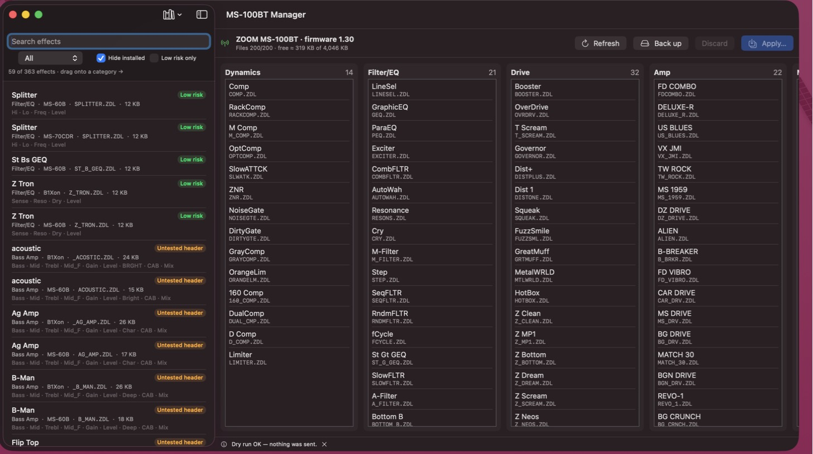

# zoom-ms100bt-bluetooth

**Install new effects on a ZOOM MS-100BT MultiStomp from a Mac — over Bluetooth, with drag and drop.**

The MS-100BT could only get extra effects through ZOOM's StompShare iOS app, which has been abandoned since 2016,
and its firmware updater is a 32-bit Intel/PowerPC app that no current Mac can run. This project reverse-engineered
the pedal's Bluetooth protocol and provides:

- **MS-100BT Manager**, a native macOS app (Apple Silicon and Intel). The left pane is a library of effect files; the
  right pane shows the pedal's effect menu by category. Drag effects in, drag to reorder, remove what you don't use, then *Apply*.
- **`ms100bt`**, the command-line engine behind the app: identify, read state, back up, apply a change plan.
- Complete protocol documentation, all verified on real hardware.



> Independent project, not affiliated with or endorsed by ZOOM Corporation. Use at your own risk.

## What has been verified on a real MS-100BT (firmware 1.30, Apple M1, macOS 26)

| | |
|---|---|
| Bluetooth connection (RFCOMM channel 2, model ID 0x5E) | ✅ |
| Listing files, free space, file-system info | ✅ |
| Full backup of all 175 stock files, CRC-checked | ✅ |
| Writing files, each one read back and compared | ✅ |
| Editing the effect menu (`FLST_SEQ.ZDT`) | ✅ |
| Effects from the **MS-60B** working on the MS-100BT (Z-Syn, Std Syn, B-Octave, Limiter, Splitter, Z-Tron, …: 27 installed) | ✅ |
| Installing and removing effects from the app (drag and drop → Apply) | ✅ |
| Factory reset (All Initialize) keeps added effects | ✅ |
| Bass categories (Bass Drive / Bass Preamp / Bass Amp) | ❌ installed but **not shown** by the MS-100BT menu; listing one under Drive **froze the pedal** |
| Community custom effects (TI C6000 DSP): **WaveFold** (matujuice) works | ✅ first one confirmed |

Things you should know:

- **The pedal holds at most 200 files**, whatever the free space. A stock pedal with the full StompShare library has 175.
  To add more, remove effects you don't use; the app keeps a copy of everything it removes.
- **After an All Initialize the pedal forgets its pairing.** Remove “ZOOM MS-100BT” in *System Settings → Bluetooth* and connect again.
- The MS-100BT is the same platform as the MS-50G: 167 of the MS-50G's 173 effects are byte-identical to the MS-100BT's.

## Download

Get **MS-100BT-Manager-x.y.z-macOS.zip** from the [Releases page](https://github.com/lopezchau/zoom-ms100bt-bluetooth/releases/latest),
unzip it and move *MS-100BT Manager* to Applications. It is a universal app (Apple Silicon and Intel), macOS 13 or later.

The app is not notarized by Apple (that needs a paid developer account), so the first launch is blocked by Gatekeeper:
right-click the app → **Open** → **Open**. On recent macOS versions, open it once, then go to *System Settings → Privacy & Security* and
click **Open Anyway**. Or run this command once:

```bash
xattr -dr com.apple.quarantine "/Applications/MS-100BT Manager.app"
```

## Requirements

- macOS 13 or later, Apple Silicon or Intel
- To build from source: Xcode Command Line Tools (`xcode-select --install`)
- A ZOOM MS-100BT. Use the AC adapter during writes: the pedal refuses to write when the batteries are low.

## Build from source

```bash
scripts/build-app.sh
```

`scripts/package-release.sh 0.2.0` builds the universal app and the release zip in `dist/`.

```bash
open "build/MS-100BT Manager.app"
```

On the pedal: press knob 1 (**MENU**) → **Bluetooth** → **PAIRING**. Then click **Connect** in the app and allow
Bluetooth access when macOS asks. Reading the pedal takes about 30 seconds.

## Getting effects

This repository contains **no ZOOM files**. The app downloads them on request:

- **Library → Download stock effect library**: 830 stock effects from the MS-50G, MS-60B, MS-70CDR, G1on and B1on
  families (363 unique), fetched from [repeat98/ZoomMultistompZDL](https://github.com/repeat98/ZoomMultistompZDL).
- **Library → Download community custom effects**: custom DSP effects, fetched from each author's repository
  (see below).
- **Back up**: copies every file on your pedal into the library. Use this first; it is the only way to keep the StompShare effects.
- **Add folder of .ZDL files**: any other folder.

Every effect shows its display name, knobs, category, origin and a risk label:

| Label | Meaning |
|---|---|
| Low risk | Standard header, no missing dependencies, a category the MS-100BT is known to show |
| Community | Custom effect; only WaveFold has been confirmed on an MS-100BT so far |
| Not shown by the MS-100BT menu | Bass categories: the effect is stored but the menu (DYN/FLTR, OD/DIST, AMP, MOD/SFX, DLY/REV) never lists it |
| Untested header | The `BCAB` header used by bass amps; never tried on an MS-100BT |
| Larger than 32 KB | Above the largest custom size known to load (on an MS-70CDR) |
| Needs expression pedal | Pedal-operated effects; the MS-100BT has no expression pedal (hidden) |
| Name longer than 8.3 | Blocked: long file names have frozen pedals at boot |

The app also adds required shared libraries automatically (for example `CMN_BASS.ZDL` for MS-60B bass drives). It
blocks effects whose effect ID clashes with one already in the same category.

## How *Apply* keeps you safe

1. It re-reads the pedal and aborts if its menu changed since you connected.
2. It checks the 200-file limit.
3. It saves the current menu and **every file it is about to delete** to `~/Library/Application Support/MS-100BT Manager/backups/`.
4. It deletes, then writes each new file and **reads it back** to compare, then writes the new menu and reads that back too.
5. It never sends firmware commands and never touches `PAIR.DAT`.

**Dry run** does steps 1–2 and sends nothing.

## Command line

`scripts/ms100bt.sh` runs the engine through a small app wrapper, so macOS grants Bluetooth access:

```bash
scripts/ms100bt.sh state
```

```bash
scripts/ms100bt.sh backup ~/Desktop/ms100bt-backup
```

Offline helpers:

```bash
.build/release/ms100bt zdl SOME.ZDL
```

```bash
.build/release/ms100bt index FLST_SEQ.ZDT
```

The Python tools `tools/zdlinfo.py` and `tools/flst.py` do the same, without building anything.

## Custom effects (TI C6000 DSP)

The MS-100BT runs effects on a TI TMS320C674x DSP, the same family as the MS-50G/60B/70CDR. Community projects already
build custom effects for it:

- [themanro/ZoomMultistompZDL](https://github.com/themanro/ZoomMultistompZDL): toolchain and 20+ effects (MS-70CDR).
  Read its [SAFE-DSP-RULES](https://github.com/themanro/ZoomMultistompZDL/blob/main/docs/SAFE-DSP-RULES.md) and LOADER-SAFETY docs.
- [matujuice/zoom-ms-zdl-effects-pack](https://github.com/matujuice/zoom-ms-zdl-effects-pack): 12 effects tested on an
  MS-60B running MS-50G firmware, the closest known setup to the MS-100BT.
- [repeat98/ZoomMultistompZDL](https://github.com/repeat98/ZoomMultistompZDL): the original toolchain and Airwindows ports.
- [marcfuentes/dustbox-zdl](https://github.com/marcfuentes/dustbox-zdl) and [marcfuentes/silverst-zdl](https://github.com/marcfuentes/silverst-zdl).

Building needs TI's C6000 compiler (CGT 8.5.0.LTS, shipped with Code Composer Studio) plus their Python linker.

**Note:** ZDLs produced by that linker embed small pieces of ZOOM runtime code. Read each project's license notes.
This is why the app downloads them from their authors instead of bundling them.

To try your own build, put the `.ZDL` (8.3 file name) in the app's *custom-effects* folder (Library menu), then drag it onto the pedal.
**WaveFold** from the matujuice pack is confirmed working on an MS-100BT. **Please report which other custom effects work** (open an issue).

## Documentation

- [docs/PROTOCOL.md](docs/PROTOCOL.md): transport, SysEx messages, file operations, effect-menu format, firmware notes, every hardware finding.
- [docs/AVAILABLE-EFFECTS.md](docs/AVAILABLE-EFFECTS.md): which MS-50G / MS-60B / other effects the MS-100BT lacks, by risk.
- [docs/PEDAL-EFFECTS.md](docs/PEDAL-EFFECTS.md): the effects on one MS-100BT, by category.

## Credits

- [mungewell/zoom-zt2](https://github.com/mungewell/zoom-zt2): the shared ZOOM file-system protocol (G-series and MS Plus).
- [repeat98](https://github.com/repeat98/ZoomMultistompZDL), [themanro](https://github.com/themanro/ZoomMultistompZDL),
  [matujuice](https://github.com/matujuice/zoom-ms-zdl-effects-pack) and [Leemuzhko](https://github.com/Leemuzhko):
  ZDL format and custom effects.
- [g200kg/zoom-ms-utility](https://github.com/g200kg/zoom-ms-utility) and
  [Barsik-Barbosik/Zoom-Firmware-Editor](https://github.com/Barsik-Barbosik/Zoom-Firmware-Editor).

## Legal

This repository contains no ZOOM firmware or effect files; `.gitignore` excludes them. ZOOM's updater license forbids
reverse engineering. The protocol was studied only to make a pedal the author owns work with current Macs, which is
interoperability. Do not use this project to redistribute ZOOM files.

Code: MIT License (see [LICENSE](LICENSE)).
